## Control the Deployment through Release Gates

Release Gates allow you to configure automated calls to external services, where the results are used to approve or reject a deployment. You can use gates to ensure that the release meets a wide range or criteria, without requiring user intervention. When a release is created from a definition that contains gates, the deployment stops until the health signals from all the configured services are successful.
Gates can be added to an environment in the release definition from the pre-deployment conditions or the post-deployment conditions panel. Multiple gates can be added to the environment conditions to ensure all the inputs are successful for the release.

**Pre-deployment gates:** You want to ensure there are no active issues in the work item or problem management system before deploying a build to an environment.

**Post-deployment gates:** You want to ensure there are no incidents from the monitoring or incident management system for the app after it's been deployed, before promoting the release.

At present the available gates include:

1. **Azure function:** Trigger execution of an Azure function and ensure a successful completion. For more details, see [Azure function task](https://docs.microsoft.com/en-us/vsts/build-release/tasks/utility/azure-function).
1. **Azure monitor:** Observe the configured Azure monitor alert rules for active alerts. For more details, see [Azure monitor task](https://docs.microsoft.com/en-us/vsts/build-release/tasks/utility/azure-monitor).
1. **Invoke REST API:** Make a call to a REST API and continue if it returns a successful response. For more details, see [HTTP REST API task](https://docs.microsoft.com/en-us/vsts/build-release/tasks/utility/http-rest-api).
1. **Work item query:** Ensure the number of matching work items returned from a query is within a threshold. For more details, see [Work item query task](https://docs.microsoft.com/en-us/vsts/build-release/tasks/utility/work-item-query).

In this lab, we will use Work item query as Pre-deployment gate and Application Insights as Post-deployment gates to monitor the application in Canary Environment. A [Canary](https://blogs.msdn.microsoft.com/devops/2017/04/24/configuring-your-release-pipelines-for-safe-deployments/) release is when you release some version of your application to a particular group of users, before it's released to everyone else. A canary release can help you to identify problems that surface in the production environment before they affect your entire user base. 

If there are any active bugs, deployment will not happen to Canary environment and after deployment if Application Insights detects any exception in Canary environment, deployment will not be promoted to Production.

## Pre-requisites

1. **Microsoft Azure Account:** You will need a valid and active azure account for the lab.

1. You will need a **Visual Studio Team Services Account**. If you do not have one, you can sign up for free here- https://www.visualstudio.com/products/visual-studio-team-services-vs

1. You will need a Personal Access Token (PAT) to set up your project using the Demo Generator.Please see this [article]((https://docs.microsoft.com/en-us/vsts/accounts/use-personal-access-tokens-to-authenticate)) for instructions to create your token.

    >**Note:**  You should treat Personal Access Tokens like passwords. It is recommended that you save them somewhere safe so that you can re-use them for future requests. 

## Exercise 1: Setting up Target Environment

In this lab we will create two **Web Apps** in Azure to depict two environments **Canary** and **Production** to deploy the application.

1. Go to Azure portal and click on **+ New** and click **Web App**.
    
    

1. Provide name for **web app**, enable **application insights** and click **create**.
    
    

1. Once the deployment succeeds, go to resource group.
    
    

1. We will See web app and application insights being provisioned. Application insights is used to monitor the Web app. Click on **Application Insights**.
    
    

1. Note down the Instrumentation Key. Instrumentation key is used to configure the SDK in the application.

    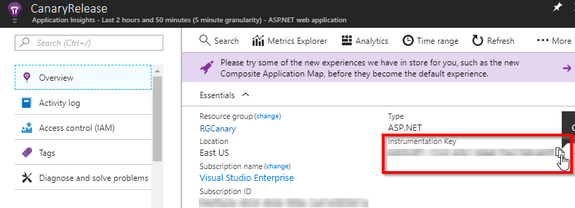

1. Scroll down and click on **Alerts**. Let us add an alert for server exceptions. 
    
    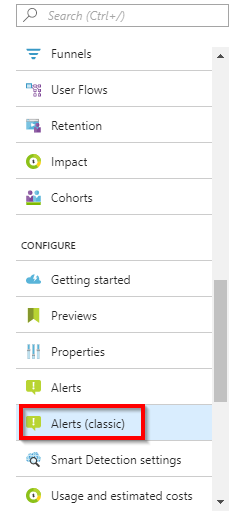

1. Click on **Add metric alert**.

    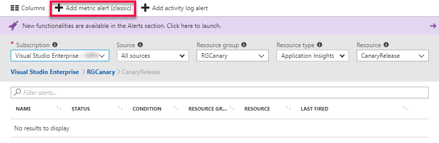

1. Provide **Name** and select **Server Exceptions** from the dropdown under metric, observe **Condition**, **Threshold** and **Period**,  and click **OK**.

    

1. Repeat **Step 1 & Step 2** to create web app for production.

## Setting up Team Services project

1. Use [VSTS Demo Data Generator](https://vstsdemobuildertest.azurewebsites.net/) to provision the project in VSTS account.

   

1. Provide a name for the project and click on **Create Project**. 

1. Once the project is provisioned, click the URL to navigate to the project.

   

   >Note: This URL will automatically select Release Gates template in the demo generator. If we want to try other projects, use this URL instead - https://vstsdemogenerator.azurewebsites.net/

## Exercise 1: Service Endpoint creation

Service endpoints are a bundle of properties securely stored by the VSTS and is a way for VSTS to connect to the external systems or services.

Since the connections are not established during project provisioning, Azure Resource Manager endpoint need to be created manually.

Azure Resource Manager Service Endpoint: Defines and secures a connection to a Microsoft Azure subscription using Service Principal Authentication (SPA).

1. In the VSTS, navigate to the **Services** by clicking on the **gear icon**, and click on the **+ New Service Endpoint** button. Select the **Azure Resource Manager**.

    

1. Provide Connection name, select the Subscription from the dropdown and click on the OK button. This endpoint will be used to connect the VSTS and the Azure.

   

## Exercise 2: Configure App-Insights 
In this exercise we will update the code with instrumentation key generated in application insights. 

1. Go to **Code** tab and navigate to path ""src/PartsUnlimitedWebsite/config.json"" and update app-insights instrumentation key in line **35**.

   

1. Commit the changes.
   
   

## Exercise 3: Enable preview feature Deployment Gates.

As Deployment Gates feature is still in preview, we should enable this feature to VSTS account.

1. In VSTS, click on logged in user and click Preview Features.
  
   

1. We will see **Approval gates in releases**. Let us turn it On.

   

## Exercise 4: Configure Deployment Gate.

### Enabling Pre-deployment Gate

1. Go to **Releases** under **Buid and Release** section, and **Edit** release definition **PartsUnlimited-CD**.

   

1. Click on **Pre-deployment conditions**. 

   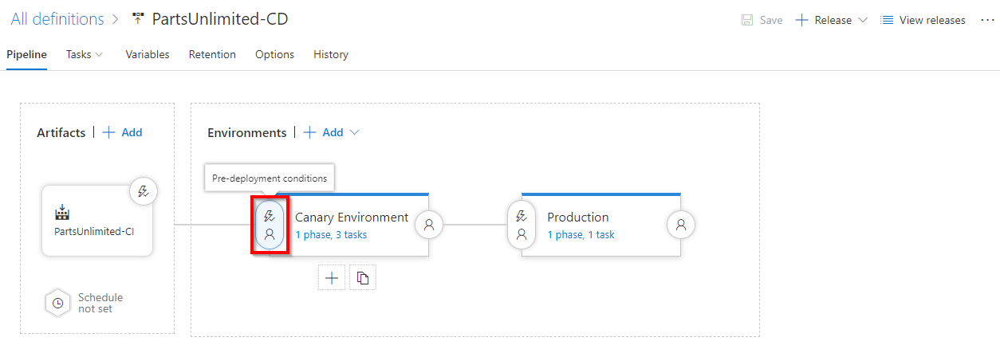

1. You will see **Triggers**, **Pre-deployment approvers**, **Gates** & **Deployment queue settings**. Let us enable **Pre-deployment approvals** and **Gates**.

   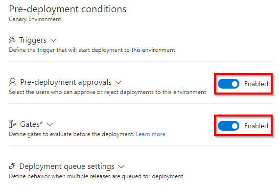

1. Add yourself as an **approver**. By default, user requesting release will not be allowed to approve. Let us uncheck this condition.

    

1. Add **Query Work Items** to the Gates.

   

1. Select **Bugs** under Query. As maximum threshold is set to 0, if this query returns any work Item, the release gate will fail.

   

1. To allow gate functions to initialize and stabilize (it may take some time for them to begin returning accurate results), we configure a delay before the results are evaluated and used to determine if the deployment should be approved or rejected. choose short periods so that we can see the results reasonably quickly. The minimum values we can specify is 6 minutes timeout and 5 minutes sampling interval.

>In this example, we have set **time between re-evaluation** as 5 minutes, **delay** as 6 minutes and **timeout** 12 minutes. When the release is triggered, gates will validate the sample in 0th and 5th minute. However, no action will be taken based on outcome. The next sample will be validated in 10th minute. If the result is "**Pass**", Notification would be sent for approval. If the result is "**Fail**", the release would time-out after 12th minute.
    
   

### Enabling Post-deployment Gate.

1. Click on Post-deployment conditions

   

1. Add **Query Azure Monitor Alerts** to the gate.

   

1. Update the details from the dropdown. 

   

1.  Open the Options for all gates section and specify the timeout and the sampling interval. For this example, 

    

    The sampling interval and timeout work together so that the gates will call their functions at suitable intervals, and reject the deployment if they don't all succeed during the same sampling interval and within the timeout period. 

### Update Release Task

1. In this release definition, we have two environments viz. Canary Environment & Production. Click on Canary environment to update the tasks

   

1. Each stage has a single task which will publish the package to Azure Web app. Let us update the Azure web app details.

   

1. Update the tasks in Prod environment and save.

   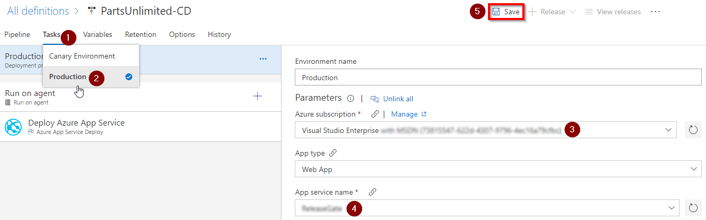

### Create New Release

1. Click on Release and Create release.
 
   

   

1. Go to Release logs to see the progress. We will see Query Work Items failing. Which indicates there are active bugs, these bugs should be closed in-order to proceed further. Next sampling time will be after 5 minutes.

   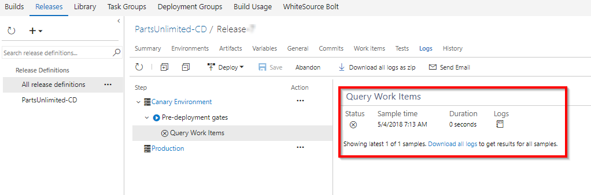 
  
 
1. Navigate to **Queries** under **Work** section.

   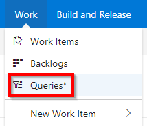

1. Select **Bugs** under **All**

   

1. We can see a bug with title **Canary Server out of disk space** in **New** State. Assuming that Infrastructure team has fixed the space issue, let us change the state to **Closed** and **Save** it.

    

1. Go back to release logs. You will see the evaluation is passed. However still the gate is under delay period we should wait for next evaluation to proceed.

     

1. When the evaluation is successful, you will see the request for pre-deployment approval. Click on approve, to deploy in Canary environment

    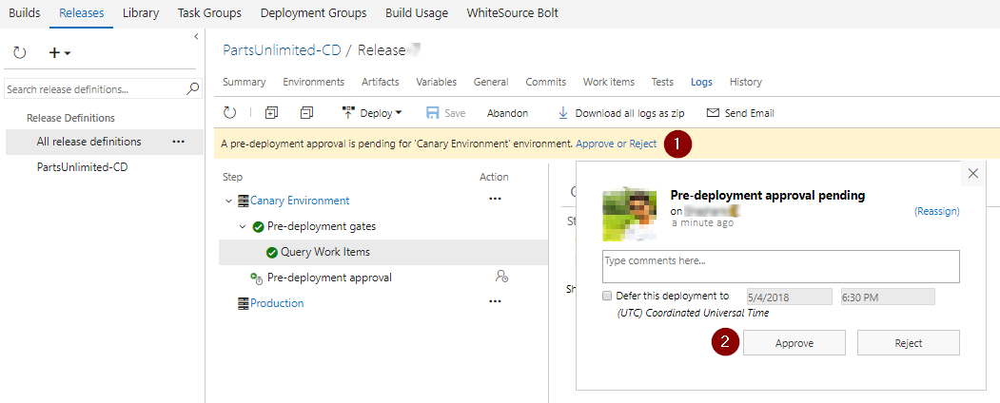

1. Once the deployment to Canary environment is successful, we will see the post deployment gates in action, which will start monitoring the app for any exceptions. 

    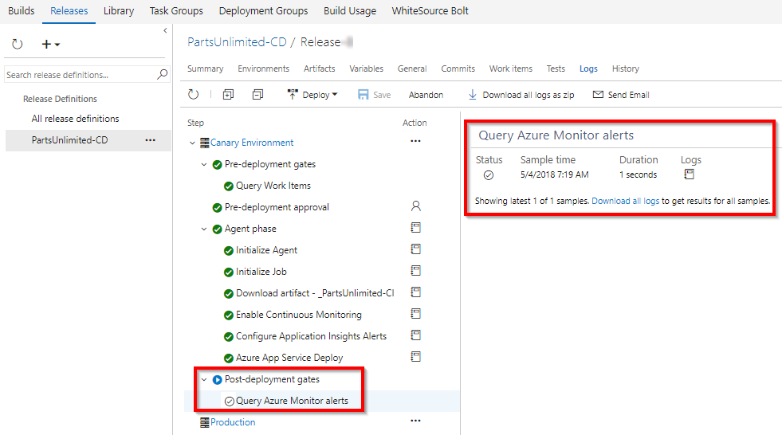

1. Let us quickly verify the application. Go to Azure web app, and click on **Browse**.

   

1. When we click on **More**, we will encounter an error. Do this couple of times for triggering alert.

   >>This error scenario just for the purpose of the lab and in real world, analysis of the alert and a resolution like “disabling a feature flag” or “upgrading the infra” would be realistic.

    
   
1. This exception is monitored by **App-Insights** which will trigger alert. In Azure Portal, we will be able to see the alert triggered.

   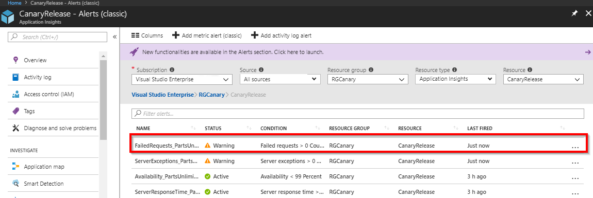
   
1. As there were exception, **Query Azure Monitor** gate will block the pipeline and prevents the deployment to **production**.

   
  

Gates ensure the release waits for us to react to feedback and fix any issues within a timeout period. Until the issues are fixed, the gate samples continue to fail and the deployment waits. Once the issues are fixed, the next sample from the gates becomes successful and the deployment automatically proceeds.
If a new release is required to fix the issues, then we can cancel the deployment, and manually abandon the current release.

Release Gates will help the teams release applications with higher confidence and fewer manual inputs. 
    
