## Control the Deployment through Release Gates

Release Gates allow you to configure automated calls to external services, where the results are used to approve or reject a deployment. You can use gates to ensure that the release meets a wide range of criteria without requiring user intervention. When a release is created from a definition that contains gates, the deployment stops until the health signals from all the configured services are successful.
Gates can be added to an environment in the release definition from the pre-deployment conditions or the post-deployment conditions panel. Multiple gates can be added to the environment conditions to ensure all the inputs are successful for the release.

**Pre-deployment gates:** Ensures there are no active issues in the work item or problem management system before deploying a build to an environment.

**Post-deployment gates:** Ensures there are no incidents from the monitoring or incident management system for the app after it's been deployed, before promoting the release to next environment.

At present the available gates include:

1. **Azure function:** Trigger execution of an Azure function and ensure a successful completion. For more details, see [Azure function task](https://docs.microsoft.com/en-us/vsts/build-release/tasks/utility/azure-function)

1. **Azure monitor:** Observe the configured Azure monitor alert rules for active alerts. For more details, see [Azure monitor task](https://docs.microsoft.com/en-us/vsts/build-release/tasks/utility/azure-monitor)

1. **Invoke REST API:** Make a call to a REST API and continue if it returns a successful response. For more details, see [HTTP REST API task](https://docs.microsoft.com/en-us/vsts/build-release/tasks/utility/http-rest-api)

1. **Work item query:** Ensure the number of matching work items returned from a query is within a threshold. For more details, see [Work item query task](https://docs.microsoft.com/en-us/vsts/build-release/tasks/utility/work-item-query)

In this lab, we will use Work item query as Pre-deployment gate and Azure monitor (Application Insight) as Post-deployment gate to monitor the application in **Canary** Environment. A Canary release is a pattern for rolling out releases to a subset of users or servers, before making it available to everybody. It is an early warning indicator with less impact on downtime: if the canary deployment fails, the rest of the servers aren't impacted. A canary release can help you to identify problems that surface in the production environment before they affect your entire user base. 

If there are any active bugs, deployment will not happen to Canary environment. Similarly, if Application Insights detects any exception in the deployed application then the deployment will not be promoted to Production.

## Pre-requisites

1. You will need a **Visual Studio Team Services Account**. If you do not have one, you can sign up for free [here](https://www.visualstudio.com/team-services/)

1. **Microsoft Azure Account:** You will need a valid and active azure account for the lab

1. You will need a **Visual Studio Team Services Account**. If you do not have one, you can sign up for free [here](https://www.visualstudio.com/team-services/)

## Setting up Target Environment

In this lab we will create two **Web Apps** in Azure to depict two environments **Canary** and **Production** to deploy the application.

1. Go to [Azure portal](https://portal.azure.com) and click on **+New** and click **Web App**.
    
    

1. Provide name for **Web App**, create new **Resource Group** or select existing one from the dropdown, enable **Application Insights** and click **Create**.
    
    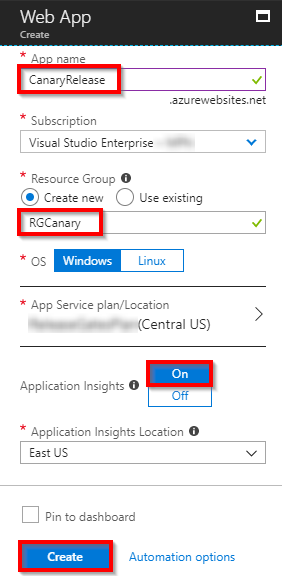

1. Once the deployment succeeds, Go to resource.
    
    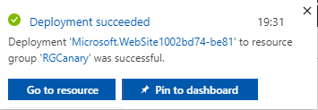

1. We will see web app and application insights being provisioned. [Application insights](https://azure.microsoft.com/en-in/services/application-insights/) is used to monitor the Web app. Click on **Application Insights** which was created just now.
    
    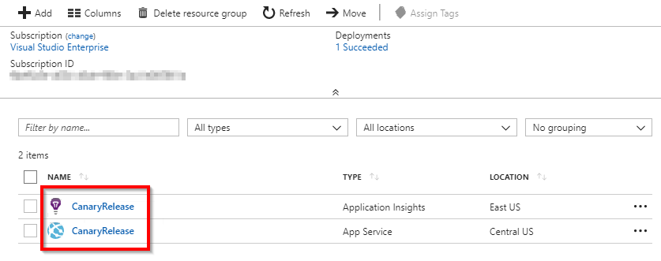

1. Note down the **Instrumentation Key** which will be used to configure the SDK in the application.

    

1. Scroll down and click on **Alerts (classic)** in the left pane. Let us add an alert for failed requests. 

1. Scroll down and click on **Alerts (classic)**. Let us add an alert for server exceptions. 

    
    

1. Click on **+Add metric alert (classic)**.

    

1. Provide a **Name** for the alert, select **Failed requests** from the dropdown under **Metric**, select **Over the last hour** as **Period** and observe **Condition**, **Threshold** then click **OK**.

    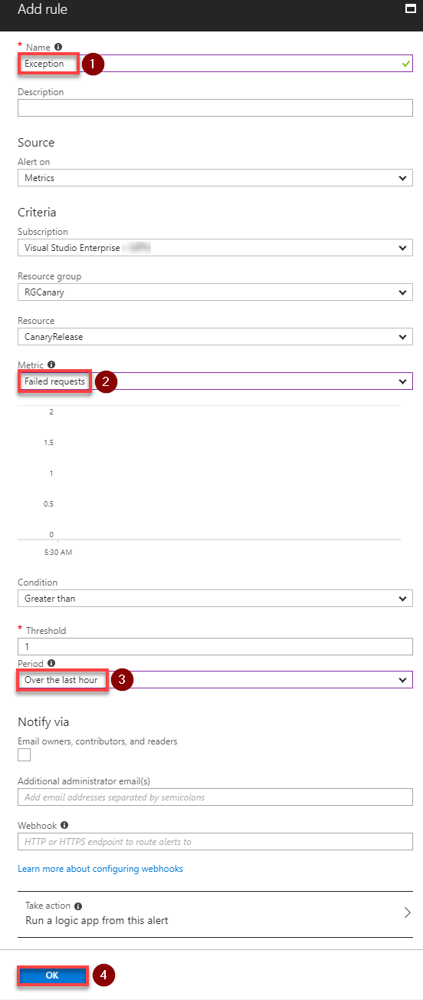

1. Repeat **Step 1 & Step 2** to create web app for production.

## Setting up the VSTS team project

Use [VSTS Demo Generator](https://demogen.azurewebsites.net/?TemplateId=77375&Name=ReleaseGates) to provision the project on your VSTS account.

   > ***VSTS Demo Generator** helps you create team projects on your VSTS account with sample content that include source code, work items, iterations, service endpoints, build and release definitions based on the template you choose during the configuration.*

    
     
1. Click the **Sign In** button to log in with your VSTS account credentials.
   

1. Accept the request for permissions by clicking on the **Accept** button.

    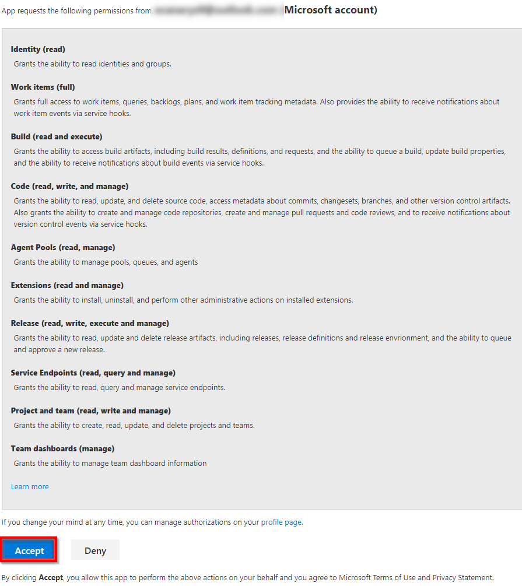

1. Select the **Team Services account** from the drop down for which you will generate the team project. Provide the **Project Name** and click **Create Project**.

    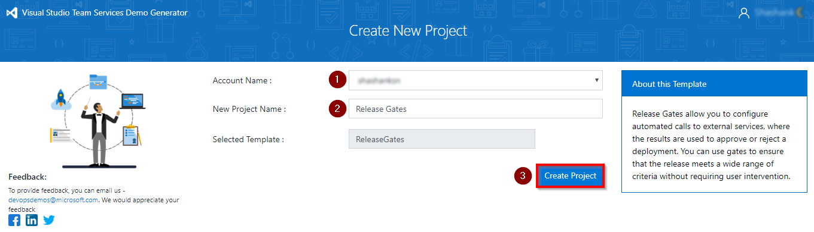

1. Once the project is provisioned, click the **URL** to navigate to the project.

   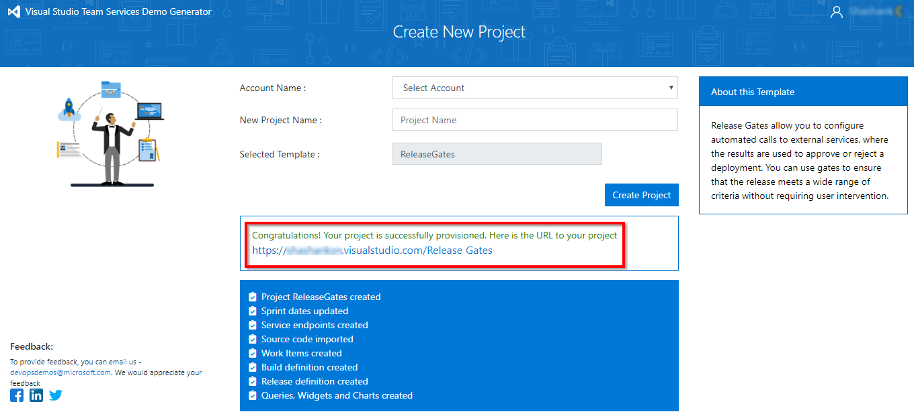

## Exercise 1: Service Endpoint creation

Service endpoints are a way for VSTS to connect to the external systems or services and they are a bundle of properties securely stored by the VSTS. Service endpoints are created at project scope, hence an endpoint created in one project will not be visible in another project.

Since the connections are not established during project provisioning, *Azure Resource Manager* endpoint need to be created manually.

**Azure Resource Manager Service Endpoint**: Defines and secures a connection to a Microsoft Azure subscription using Service Principal Authentication (SPA).

1. To setup Azure Service endpoint in VSTS, navigate to your Team Project and click on  gear icon. Click **Services** tab and click on **+New Service Endpoint** in the left pane. From the drop-down, select **Azure Resource Manager**.

   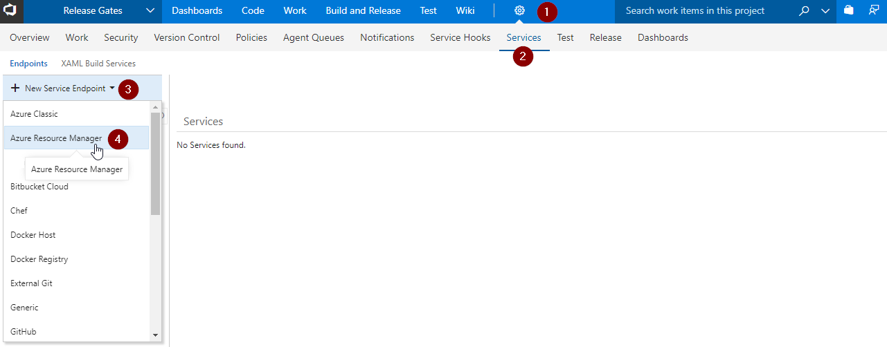 

1. Specify **Connection name**, select your **Subscription** from the dropdown and click **OK**. This endpoint will be used to connect VSTS and Azure.

   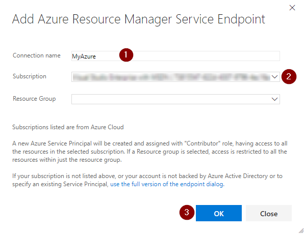

    

## Exercise 2: Configure Deployment Gates.

### Enabling Pre-deployment Gate

1. Go to **Releases** under **Buid and Release** section and **Edit** release definition **PartsUnlimited-CD**.

   

1. Click on **Pre-deployment conditions**. 

   

1. You will see **Triggers**, **Pre-deployment approvals**, **Gates** and **Deployment queue settings**. Let us enable **Pre-deployment approvals** and **Gates**.

   

1. Add yourself as an **Approver** and by default, user requesting a release or deployment should not approve. However for this lab purpose, let us uncheck this condition.

    
1. Add **Query Work Items** to the Gates.

   

1. Select **Bugs** under Query. As maximum threshold is set to "0", if this query returns any work Item, the release gate will fail.

   

1. Let us set the evaluation options.

   >*Delay before evaluation:* Time before the added gates are evaluated for the first time. If no gates are added, then the deployments wait for the duration before proceeding. To allow gate functions to initialize and stabilize (it may take some time for it to begin returning accurate results), we configure a delay before the results are evaluated and used to determine if the deployment should be approved or rejected.
   
   >*Time between re-evaluation of gates:* The time interval between each evaluation of all the gates. At each sampling interval, new requests are sent concurrently to each gate for fresh results. The sampling interval must be greater than the longest typical response time of any configured gate to allow time for all responses to be received.

   >*Timeout after which gates fail:* The maximum evaluation period for all gates. The deployment will be rejected if the timeout is reached before all gates succeed during the same sampling interval. The minimum value we can specify for timeout is 6 minutes and 5 minutes for sampling interval.

   In this example, we have set **Delay before evaluation** as *5 minutes* (so that we can see the results reasonably quick.), **Time between re-evaluation of gates** as *5 minutes* (sampling interval) and **Timeout after which gates fail** as *12 minutes*. When the release is triggered, gate will validate the samples at *0th and 5th minutes*. However, no action will be taken based on outcome of these two samples until the next sample validates at *10th minute*. If the result is "**Pass**", notification will be sent for approval. If the result is "**Fail**", the release will time-out after *12th minute*.

   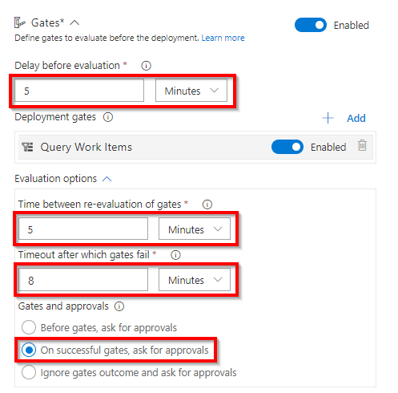

### Enabling Post-deployment Gate.

1. Click on **Post-deployment conditions**

   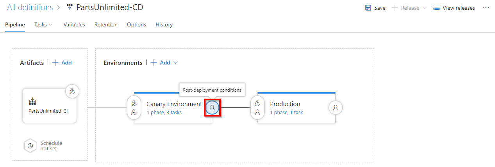

1. Enable **Gates** and Add **Query Azure Monitor Alerts** to the gate.

   

1. Update the details from the dropdown. 

   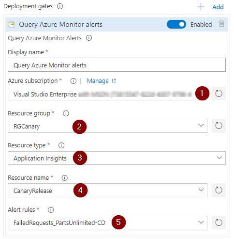

1.  Expand the **Evaluation options** and specify the *delay*, *timeout* and the *sampling interval*. 

    

    >The sampling interval and timeout work together so that the gates will call their functions at suitable intervals and reject the deployment if they don't succeed during the same sampling interval within the timeout period. 

### Update Release Task

1. In this release definition, we have two environments viz. *Canary Environment* & *Production*. Click on Canary Environment to update the tasks.

   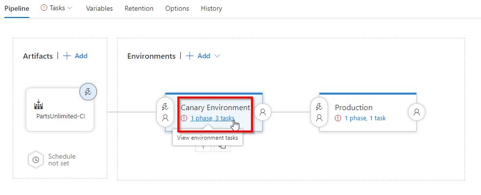

1. Each environment has a single task which will publish the package to Azure Web App. Let us update the Azure web app details.

   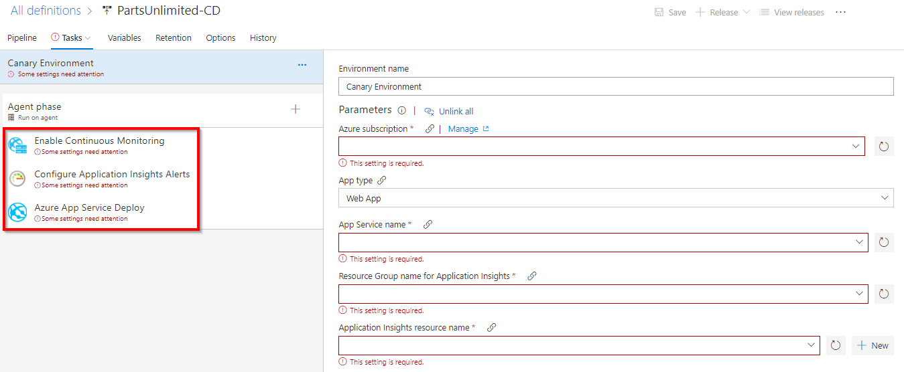

1. Update the tasks in Production environment and save.

   

## Exercise 3: Configure Application Insights 
In this exercise, we will update the code with *Instrumentation key* generated in application insights. 

1. Go to **Code** tab. Navigate to path *"src/PartsUnlimitedWebsite/appsettings.json"* and update application insights instrumentation key in **line 3**.

   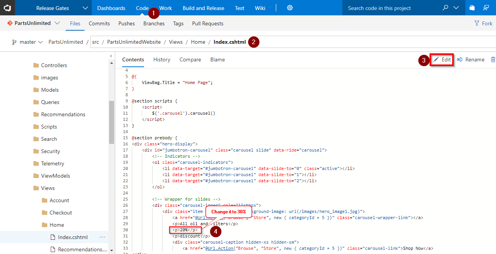

1. Commit the changes.
   
   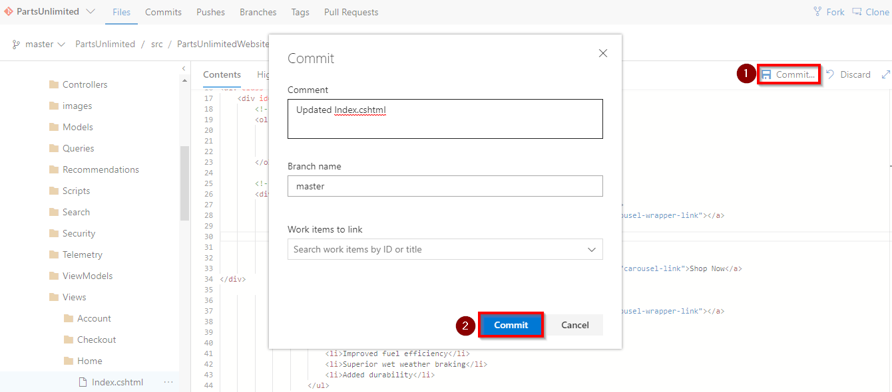

1. The build will automatically trigger as we have Continuous Integration (CI) trigger type enabled in the Build definition. Once the Build succeeds, navigate to the **Releases** tab. You will notice the release have been triggered after the successful build.

1. Go to Release logs to see the progress. We will see Query Work Items have failed in delay before evaluation, which indicates there are active bugs. These bugs should be closed in-order to proceed further. Next sampling time will be after 5 minutes.

    
  
 
1. Navigate to **Queries** under **Work** tab.

   

1. Select **Bugs** under **Shared Queries**

   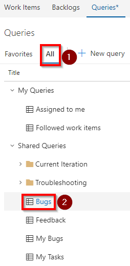

1. We will see a bug with title "**Disk out of space in Canary Environment**" in **New** State.
Assuming that Infrastructure team has fixed the disk space issue, let us change the state to **Closed** and **Save** it.

    

1. Go back to release logs. You will see the evaluation has passed.

    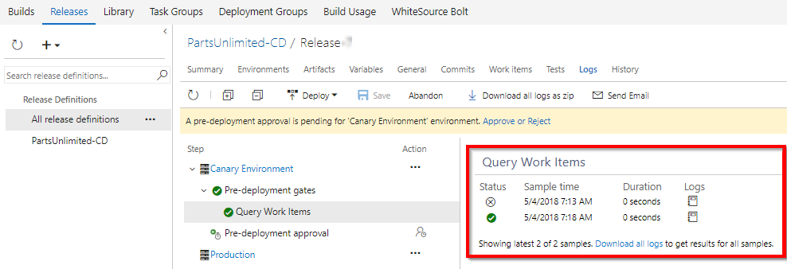 

1. When the evaluation is successful, you will see the request for pre-deployment approval. Click on **Approve** to deploy in Canary environment

    

1. Once the deployment to Canary environment is successful, we will see the post-deployment gates in action which will start monitoring the application for any exceptions. 

    

1. Let us quickly verify the application. Go to Azure web app in 
Azure Portal and click on **Browse**.

   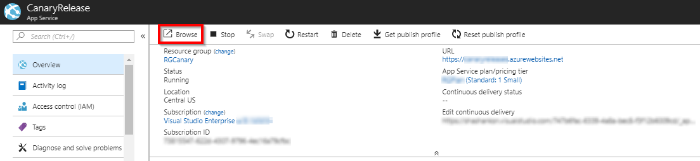

1. After application is launched, click on **More**. We will encounter with an error page. Do this couple of times for triggering alert.

   >This error scenario is just for the purpose of the lab and in real world, analysis of the alert and a resolution like “disabling a feature flag” or “upgrading the infra” would be realistic.

    
   
1. This exception is monitored by **Application Insights** which will trigger alert. In Azure Portal, we will be able to see the alert triggered.

   

1. As there was an alert triggered by the exception, **Query Azure Monitor** gate have failed. However, still the gate is under delay period and we should wait for next evaluation to proceed.

   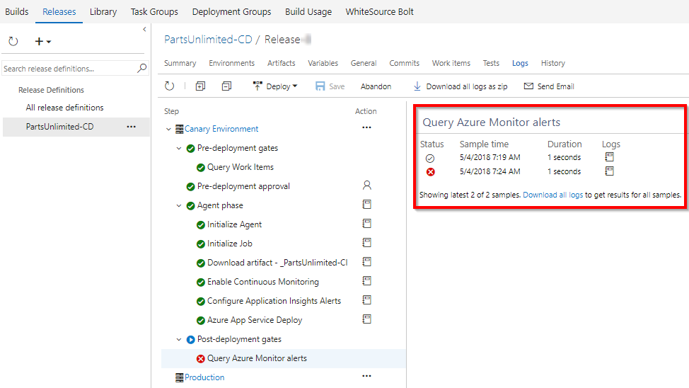
   
1. As the next step, **Query Azure Monitor** gate will block the pipeline and prevents the deployment to **Production** Environment.

   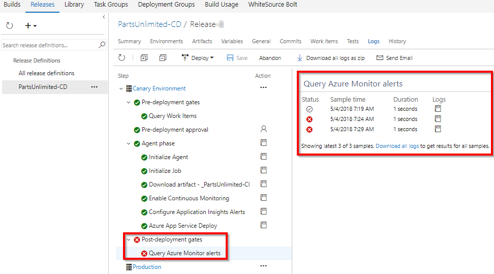
  

Gates ensures that the release waits for us to react to the feedback and fix any issues within a timeout period. The gate-samples continue to fail and the deployment waits until the issues are fixed. Once the issues are fixed, the next sample from the gates becomes successful and the deployment automatically proceeds.

If a new release is required to fix the issues, then we can cancel the deployment and manually abandon the current release.

Release Gates will help the teams release applications with higher confidence and fewer manual inputs. 
    
